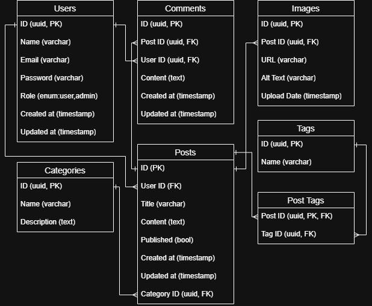

# Go Gin Hexagonal Architecture

A blog REST API to demonstrate Hexagonal Architecture built with Go

## Features

- [ ]  REST APIs: Gin
- [ ]  Auth: JWT
- [ ]  DB: Postgres, 
- [ ]  Caching: Redis
- [ ]  Unit tests: Mockery
- [ ]  CI / CD: Github Actions
- [ ]  Hot reload: Air
- [ ]  Swagger docs generator: Swago
- [ ]  Logging: Logrus
- [ ]  Go File Upload: Cloudinary
- [ ]  Monitoring: Prometheus, Grafana, Zerolog
